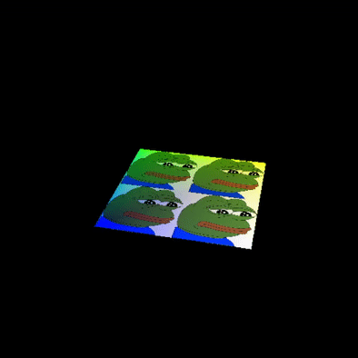

# MD Vulkan Renderer

# Goals
## Ver0.1.0

### Setup

- [x] Create instace
- [x] Get physical device
- [x] Create logical device

### Presentation

- [x] Create Surface
- [x] Swap Chain
- [x] Image views

### Graphics pipeline basics

- [x] Shader modules
- [x] Fixed Functions
- [x] Render passes

### Drawing

- [x] Framebuffers
- [x] Command buffers
- [x] Rendering and presentation
- [x] Frames in flight
- [x] Swapchain Recreation

### Triangle 

## Ver0.2.0

### Vertex Buffers

- [x] Vertex Buffers
- [x] Staging Buffer

## Ver0.3.0

### Uniform Buffers

## Ver0.4.0

### Texture mapping

- [x] Image
- [x] Image view and sample
- [x] Combined image sampler

### Pepe

## Ver0.5.0

### Depth buffering

- [x] 3D geometry support

### Pepe 2

## Ver0.6.0

### Loading models

- [x] Draw a model with texture

### Viking room

- Viking room model by [nigelgoh](https://sketchfab.com/nigelgoh) (CC BY 4.0)

## Ver0.7.0

### Generating Mipmaps

## Ver1.0.0

### Multisampling